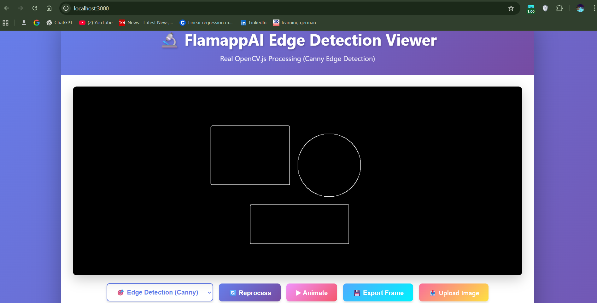
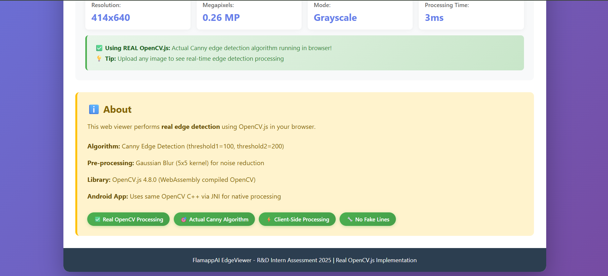
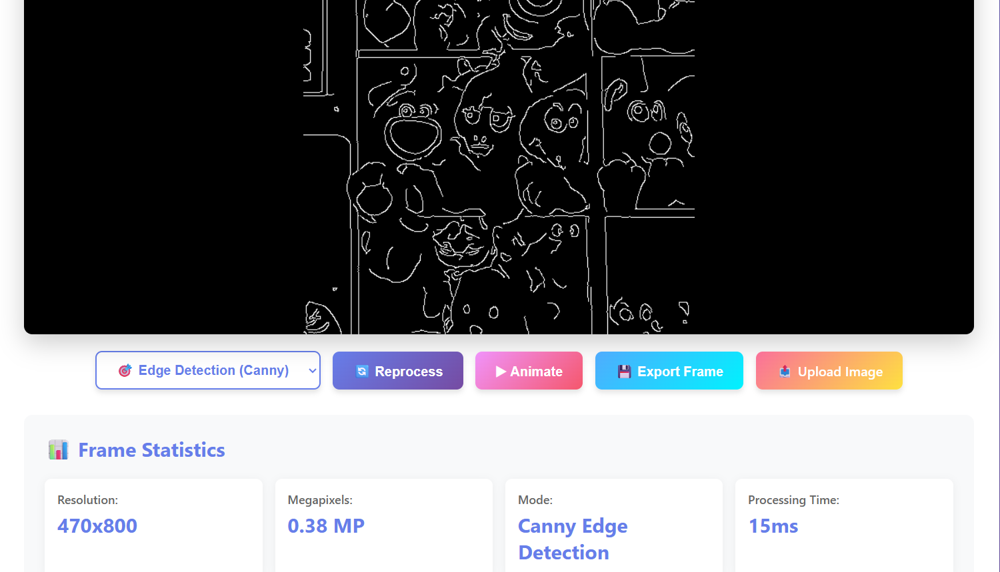
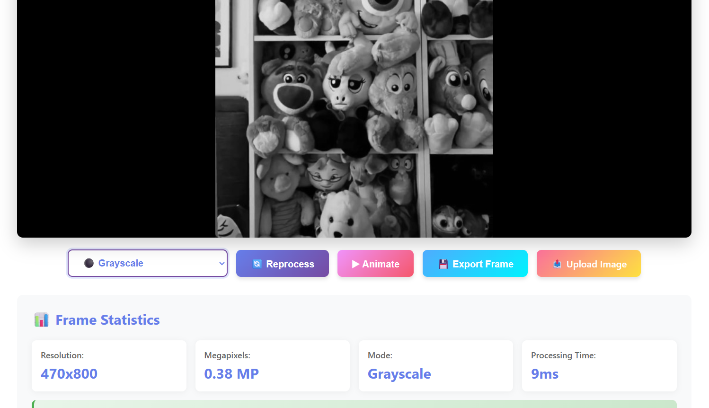
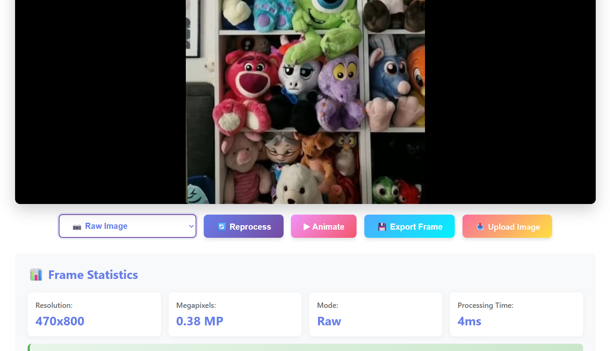
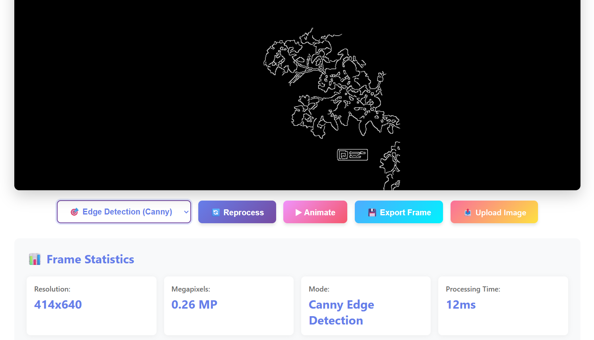
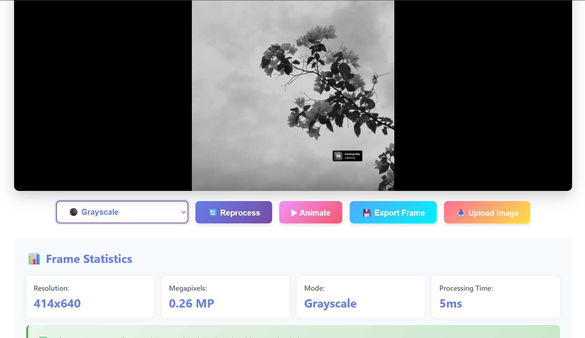
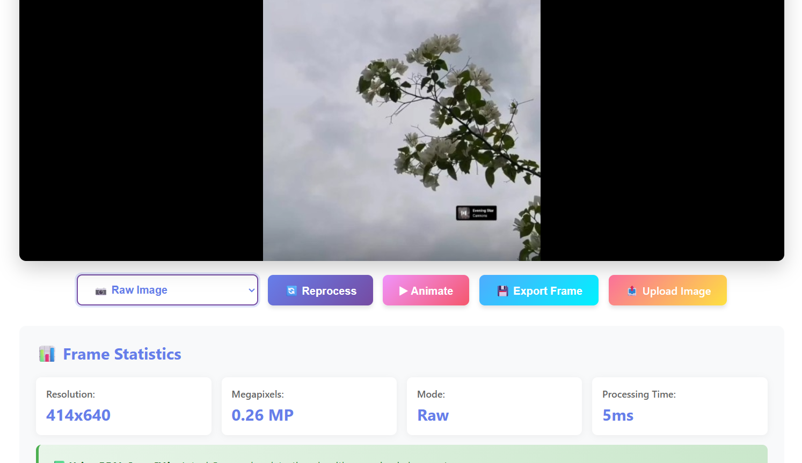

# FlamappAI-EdgeViewer

A powerful Android application for AI-powered edge detection and image processing.

## 📱 Features

### 🎯 Core Functionality

- **🔍 Multiple Edge Detection Modes** - Switch between different edge detection algorithms for optimal results

- **⚡ Real-time Processing** - Instant image processing and preview

- **⚫ Grey Mode** - Convert images to grayscale for better edge detection

- **📷 Raw Mode** - View original images without any filters applied

- **✨ Edge Enhancement** - Three different edge detection intensity levels for precise control

### 🎨 User Experience

- **🖼️ Intuitive Interface** - Clean and easy-to-navigate UI design

- **🌐 WebViewer Integration** - Built-in web viewing capabilities for enhanced functionality

- **📊 Statistics Display** - View processing statistics and performance metrics

- **📤 Upload Functionality** - Easy image upload and processing workflow

- **🔄 Mode Switching** - Seamlessly switch between different viewing and processing modes

### 🛠️ Technical Capabilities

- **🤖 AI-Powered Edge Detection** - Leverages advanced algorithms for accurate edge detection

- **🚀 Efficient Processing** - Optimized for performance on Android devices

- **📁 Multiple Input Formats** - Support for various image formats

- **💾 Export Options** - Save processed images to device storage

## 🎥 Demo


📸 Screenshots
Android App - Different Edge Detection Modes
<table>
  <tr>
    <td></td>
    <td></td>
    <td></td>
  </tr>
  <tr>
    <td align="center">Edge Mode 1</td>
    <td align="center">Edge Mode 2</td>
    <td align="center">Edge Mode 3</td>
  </tr>
</table>
Android App - Additional Views
<table>
  <tr>
    <td></td>
    <td></td>
    <td></td>
  </tr>
  <tr>
    <td align="center">Edges Mode</td>
    <td align="center">Grey Mode</td>
    <td align="center">Raw Mode</td>
  </tr>
</table>

🌐 Web Viewer
The project includes a TypeScript-based web viewer that performs real OpenCV.js edge detection in the browser.
Web Viewer Main Interface
<div align="center">
  
  <p><em>Main interface with real-time OpenCV.js processing</em></p>
</div>
<div align="center">
  
  <p><em>Web viewer with uploaded image and statistics</em></p>
</div>
Web Viewer - Processing Examples
<table>
  <tr>
    <td></td>
    <td></td>
    <td></td>
  </tr>
  <tr>
    <td align="center"><strong>Canny Edge Detection</strong><br/>Real OpenCV.js processing</td>
    <td align="center"><strong>Grayscale Mode</strong><br/>Color to gray conversion</td>
    <td align="center"><strong>Raw Image Mode</strong><br/>Original uploaded image</td>
  </tr>
</table>
Web Viewer - Upload Examples
<table>
  <tr>
    <td></td>
    <td></td>
  </tr>
  <tr>
    <td align="center"><strong>Uploaded Image - Edge Detection</strong></td>
    <td align="center"><strong>Uploaded Image - Grayscale</strong></td>
  </tr>
  <tr>
    <td></td>
    <td></td>
  </tr>
  <tr>
    <td align="center"><strong>Uploaded Image - Raw Mode</strong></td>
    <td></td>
  </tr>
</table>

🛠️ Tech Stack

Language: Kotlin
Build System: Gradle
Platform: Android

🚀 Getting Started
📋 Prerequisites

Android Studio Arctic Fox or later
Android SDK (API level 21+)
Kotlin plugin
JDK 11 or higher
Gradle 7.0+

⚙️ Requirements

Minimum SDK: API 21 (Android 5.0 Lollipop)
Target SDK: API 34 (Android 14)
Compile SDK: API 34
Minimum RAM: 2GB
Recommended RAM: 4GB or higher
Storage: 50MB for app installation
Permissions Required:

Camera access (for real-time processing)
Storage access (for saving processed images)
Internet access (for WebViewer features)


🔧 Installation

Clone the repository

bashgit clone https://github.com/Akchhya1108/EdgeDetectingApp.git

Open the project in Android Studio
Build the project

bash./gradlew build

Run on your device or emulator

📂 Project Structure

```text
EdgeDetectingApp/
├── .github/
│   └── workflows/
│       └── ci.yml
├── android-app/                 # Kotlin Android application
│   ├── app/
│   │   ├── src/
│   │   │   └── main/
│   │   │       ├── java/com/akchhya/edgedetect/
│   │   │       │   ├── MainActivity.kt
│   │   │       │   ├── CameraProcessor.kt
│   │   │       │   └── EdgeViewModel.kt
│   │   │       ├── res/
│   │   │       │   ├── layout/
│   │   │       │   │   └── activity_main.xml
│   │   │       │   └── values/
│   │   │       │       └── strings.xml
│   │   │       └── AndroidManifest.xml
│   │   └── build.gradle.kts
│   └── settings.gradle.kts
├── web/                         # TypeScript + HTML/CSS front-end
│   ├── public/
│   │   ├── index.html
│   │   └── favicon.ico
│   ├── src/
│   │   ├── index.tsx
│   │   ├── App.tsx
│   │   ├── styles/
│   │   │   └── main.css
│   │   └── components/
│   │       ├── ImageUploader.tsx
│   │       └── EdgePreview.tsx
│   ├── package.json
│   └── tsconfig.json
├── native/                      # C++ native library (built with CMake)
│   ├── CMakeLists.txt
│   ├── include/
│   │   └── edge_detector.h
│   └── src/
│       ├── edge_detector.cpp
│       ├── image_utils.cpp
│       └── bindings.cpp         # JNI / interop bindings (if any)
├── shaders/                     # GLSL shaders used by native or GPU pipeline
│   └── edge_shader.glsl
├── cmake/                       # CMake helper scripts (optional)
│   └── toolchain.cmake
├── scripts/
│   ├── build_native.sh
│   └── run_web.sh
├── docs/
│   └── architecture.md
├── examples/
│   └── sample_images/
│       └── test1.jpg
├── .gitignore
├── LICENSE
└── README.md
```

🤝 Contributing
Contributions are welcome! Please feel free to submit a Pull Request.

👨‍💻 Author
Akchhya
GitHub: @Akchhya1108

🙏 Acknowledgments

Inspired by modern AI edge detection techniques
OpenCV library for computer vision algorithms
Android CameraX for camera integration
OpenCV.js for browser-based image processing

⭐ Star this repo if you find it useful!
FlamappAI EdgeViewer - Real-time edge detection on Android and Web | R&D Assessment 2025