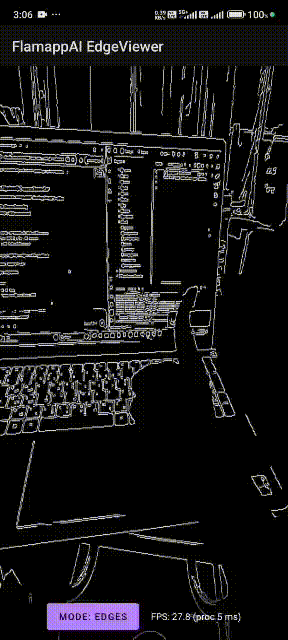
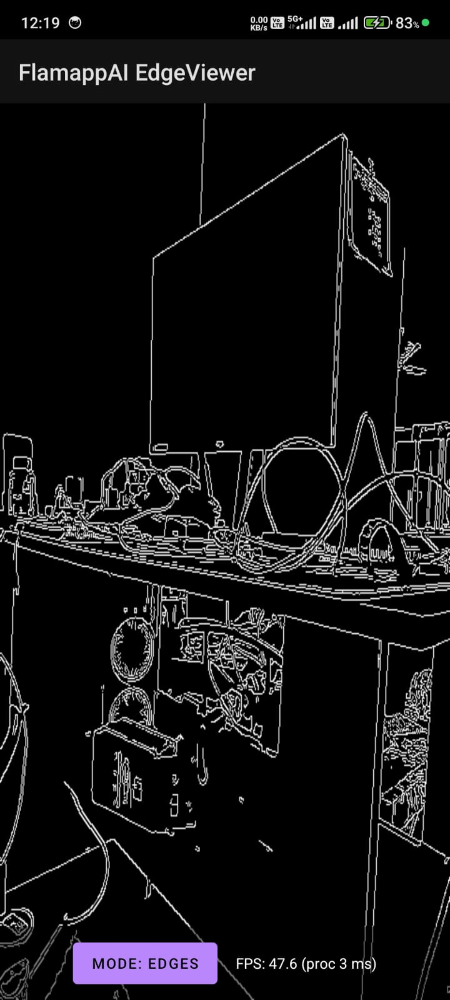
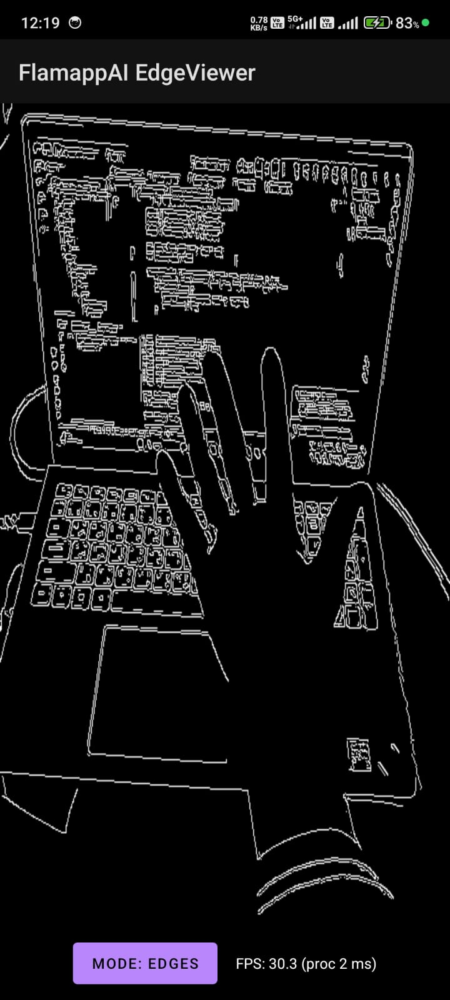
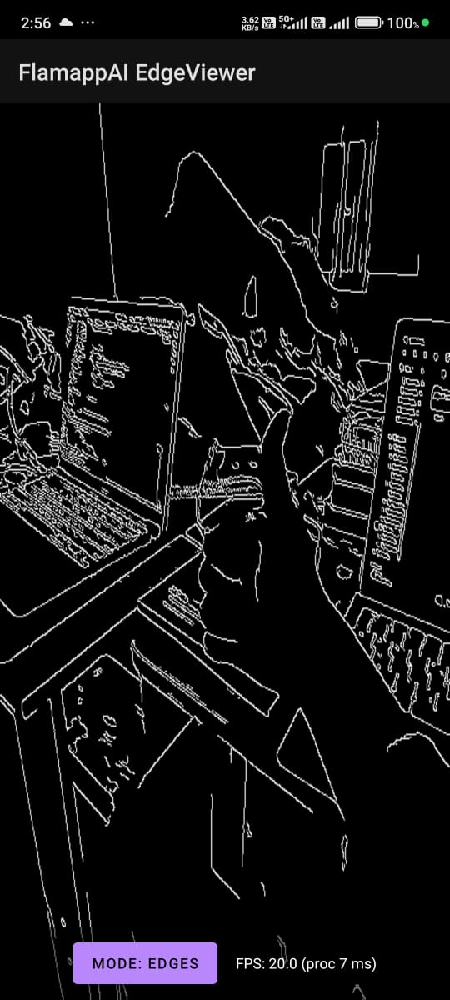
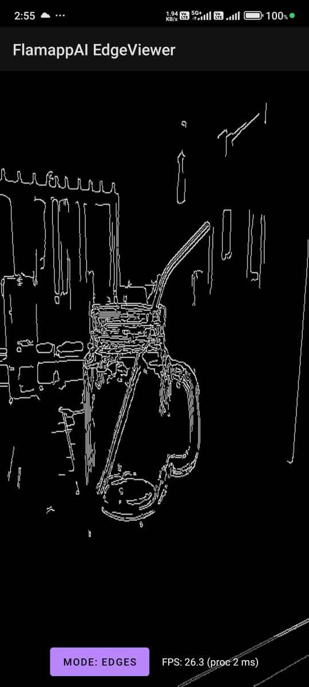
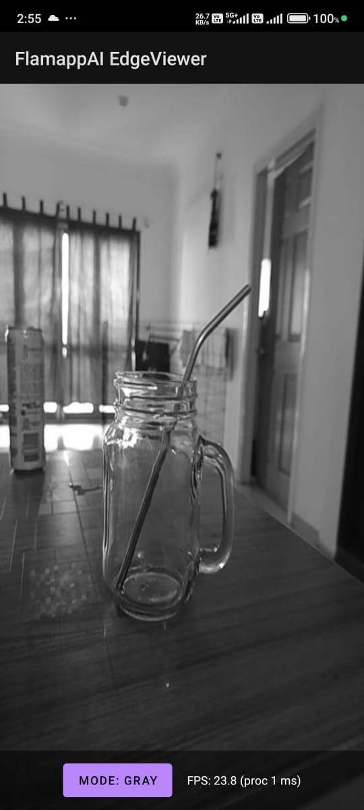
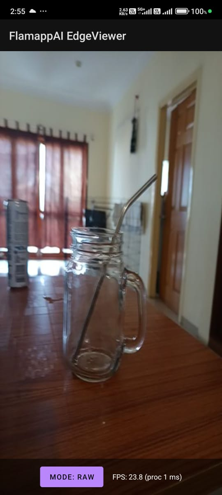

# FlamappAI-EdgeViewer

A powerful Android application for AI-powered edge detection and image processing.

## 📱 Features

### 🎯 Core Functionality

- **🔍 Multiple Edge Detection Modes** - Switch between different edge detection algorithms for optimal results

- **⚡ Real-time Processing** - Instant image processing and preview

- **⚫ Grey Mode** - Convert images to grayscale for better edge detection

- **📷 Raw Mode** - View original images without any filters applied

- **✨ Edge Enhancement** - Three different edge detection intensity levels for precise control

### 🎨 User Experience

- **🖼️ Intuitive Interface** - Clean and easy-to-navigate UI design

- **🌐 WebViewer Integration** - Built-in web viewing capabilities for enhanced functionality

- **📊 Statistics Display** - View processing statistics and performance metrics

- **📤 Upload Functionality** - Easy image upload and processing workflow

- **🔄 Mode Switching** - Seamlessly switch between different viewing and processing modes

### 🛠️ Technical Capabilities

- **🤖 AI-Powered Edge Detection** - Leverages advanced algorithms for accurate edge detection

- **🚀 Efficient Processing** - Optimized for performance on Android devices

- **📁 Multiple Input Formats** - Support for various image formats

- **💾 Export Options** - Save processed images to device storage

## 🎥 Demo

## 📸 Screenshots

### Different Edge Detection Modes

<table>
  <tr>
    <td></td>
    <td></td>
    <td></td>
  </tr>
  <tr>
    <td align="center">Edge Mode 1</td>
    <td align="center">Edge Mode 2</td>
    <td align="center">Edge Mode 3</td>
  </tr>
</table>

### Additional Views

<table>
  <tr>
    <td></td>
    <td></td>
    <td></td>
  </tr>
  <tr>
    <td align="center">Edges Mode</td>
    <td align="center">Grey Mode</td>
    <td align="center">Raw Mode</td>
  </tr>
</table>

🛠️ Tech Stack

Language: Kotlin
Build System: Gradle
Platform: Android

🚀 Getting Started
📋 Prerequisites

Android Studio Arctic Fox or later
Android SDK (API level 21+)
Kotlin plugin
JDK 11 or higher
Gradle 7.0+

⚙️ Requirements

Minimum SDK: API 21 (Android 5.0 Lollipop)
Target SDK: API 34 (Android 14)
Compile SDK: API 34
Minimum RAM: 2GB
Recommended RAM: 4GB or higher
Storage: 50MB for app installation
Permissions Required:

Camera access (for real-time processing)
Storage access (for saving processed images)
Internet access (for WebViewer features)

🔧 Installation

Clone the repository

bashgit clone https://github.com/Akchhya1108/EdgeDetectingApp.git

Open the project in Android Studio
Build the project

bash./gradlew build

Run on your device or emulator

📂 Project Structure

FlamappAI-EdgeViewer/
├── .kotlin/
├── app/
├── build/
├── docs/
│   ├── Demo_gif/
│   │   ├── Demo_gif.mp4
│   │   └── Demo_gif2.gif
│   └── screenshots/
│       ├── App_SS/
│       └── WebViewer/
└── gradle/

🤝 Contributing
Contributions are welcome! Please feel free to submit a Pull Request.

👨‍💻 Author
Akchhya

🙏 Acknowledgments

Inspired by modern AI edge detection techniques

⭐ Star this repo if you find it useful!